# Noodle

Noodle is a content creation framework built on RevealJS. It pulls together a collection of open source tools, scripts, and custom code snippets for the generation of content for teaching and learning.

The content is produces can quickly be embedded into any Moodle homepage. 
<!-- .element: class="fragment" -->

---

## Why not tick with MS Powerpoint or Pages? 

Moving from a GUI based system, such as Powerpoint, to a text based one can be challenging. The rewards to using a system like this is that you can embed any kind of content you wish, and are not stuck to proprietary formats. If you wish to discuss machine learning, you can just add a ML library and embed a live demo. If you are teaching audio synthsis you can turn your presentation into an audio synthesiser that students can play with. 

If you use Github to manage your content you can keep track of all your changes. Therefore you can recall any previous edit of your content at any time. You can also quickly collaborate with colleagues by either adding them as contributors, or through the use of Github pull requests. 

---

## Getting started

This content creation framework requires the following packages:

---

## Visual Studio Code

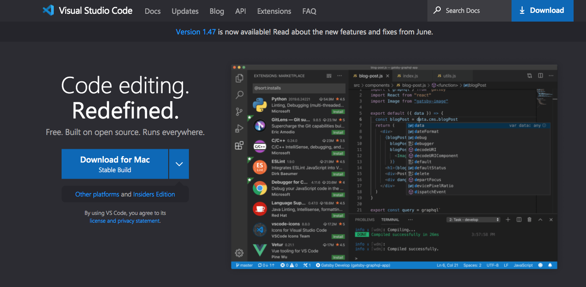

<blockquote style="color:#ff4">
Be sure to download an install Visual Studio Code, not Visual Studio!</blockquote>
<!-- .element: class="fragment" -->

---

## VS Code Live Server extension

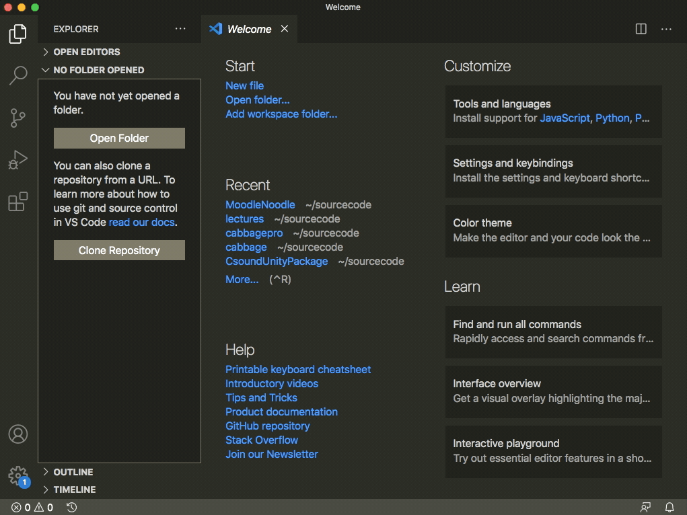

The Live Server extension will *serve* your content in a browser so you can see how it looks. 

---

## Python

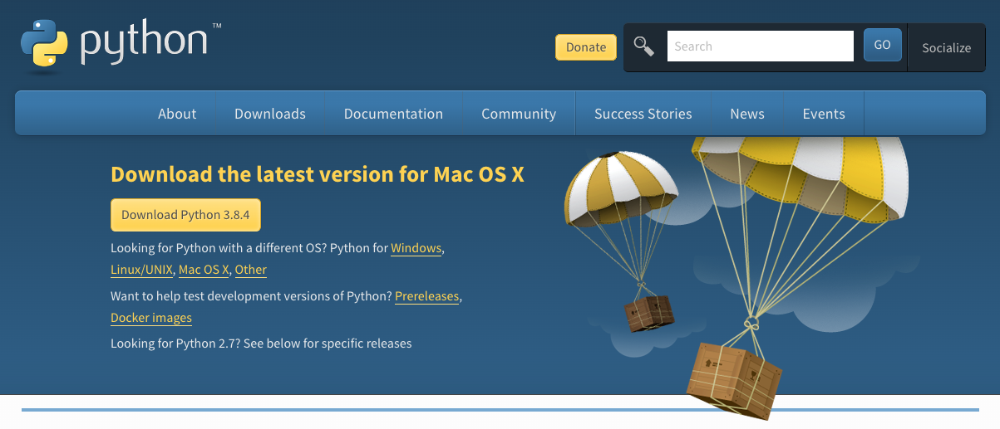

The build scripts for this framework use Python 3. If you already have another version of Python installed, just edit the `.vscode/tasks.json` file.  

---

Noodle ships with the following open source frameworks:

[RevealJS](https://revealjs.com/)
RevealJS is responsible for all the layout, formatting, and presentation aspects of your content. 

[Katex](https://katex.org/)
For creating mathematical content, similar to Latex. 

[Csound](https://csound.org/)
For realtime synthesis and audio processing (in cases where HTML5-WebAudio isn't up to the task)

[p5js](http://p5js.org)
For animations, video processing, etc

[Plotly](https://plotly.com/javascript/)
For plotting graphs

<blockquote style="color:#ff4">
Note that just about any JS framework can be used. You are not limited in any way to the ones presented above. </blockquote><!-- .element: class="fragment" -->

---

## Getting set up

Download or clone the Noodle source from https://github.com/rorywalsh/Noodle

The *SampleModule* folder can be use as a template for all modules. Simple copy, paste and rename. 

---

Open Visual Studio code, and then open the root Noodle folder, i.e., the one containing all the module folders. 

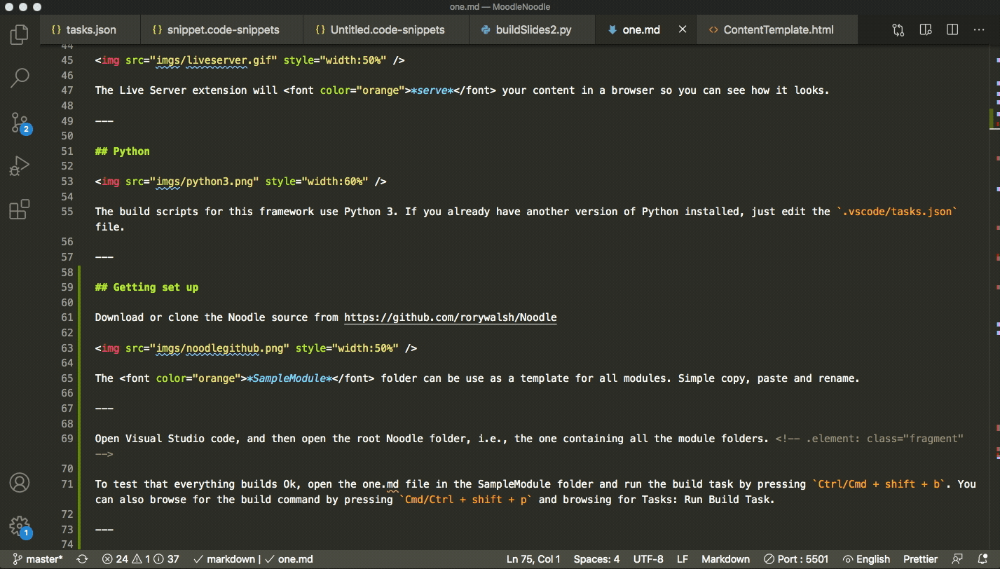

To test that everything builds Ok, open the one.md file in the SampleModule folder and run the build task by pressing Ctrl/Cmd + shift + b. You can also browse for the build command by pressing Cmd/Ctrl + shift + p and browsing for Tasks: Run Build Task. 

<!-- .element: class="fragment" -->

<blockquote style="color:#ff4">
You only have to build once in order to create the corresponding html file. After that, each edit you make to the .md file will automatically appear in your slides. </blockquote>
<!-- .element: class="fragment" -->

---

## Viewing your content

If the build was successful, you will have a new html file, called after the .md file. If your .md file is named lecture1, the corresponding html file, after you built it, will be called lecture1.html. 

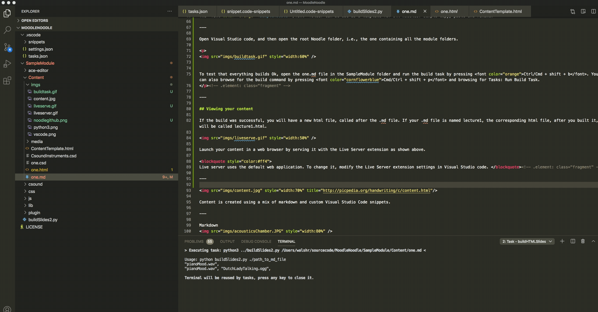

Launch your content in a web browser by serving it with the Live Server extension as shown above. Your html file will automatically update whenever you change your .md file. .

<blockquote style="color:#ff4">
Live server uses the default web application. To change it, modify the Live Server extension settings in Visual Studio code. </blockquote><!-- .element: class="fragment" -->

---

 

---

## Markdown

Markdown is very simple markup(?) language that is used to format your text. It can be used to add all sorts of common formatting such as italics, quotes, code examples, bullet points, etc. 

A full overview of markdown formatting can be found [here](https://github.com/adam-p/markdown-here/wiki/Markdown-Cheatsheet). 

<blockquote style="color:#ff4">
Noodle configures RevealJS to use `---` as horizontal slider separators. `--` is used to denote a vertical slide separator.</blockquote><!-- .element: class="fragment" -->

---

## Noodle quick formatting snippets

In order to speed up the creation of content, Noodle ships with a custom snippets file that contains shortcuts for a range of formatting syntax. These so-called *snippets* need to be installed before you can use them.

<blockquote style="color:#ff4">
The code snippets are contained within the NoodleSnippets.code-snippets file in the .vscode folder of this repository.  </blockquote>

---

## Selected snippets

In order to use a snippet, just start typing the name of the snippet and then press Ctrl+Spacebar. This will bring up a list of available snippets. 

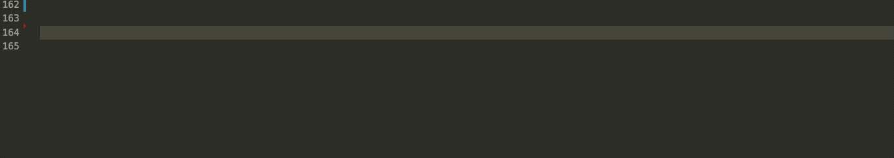
<!-- .element: class="fragment" -->

Text that appears on a mouse click is done with so-called 'fragments'. To add a fragment, type fragment under your line of text and hit ctrl+space, then hit enter. It will add some html code to your .md text. If you wish to group several elements into a single fragment, use the 'section' snippet. 
<!-- .element: class="fragment" -->

---

Text can be coloured using a variety of colour snippets. High light the code you wish to colour, and copy it to the clipboard. Then, without deselecting the word type colour, followed by ctrl+space to bring up the list of available colours. Choose one and hit enter. It will add the correct html formatting to your text, as shown in the gif below.

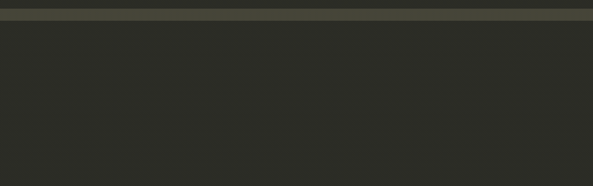

<!-- .element: class="fragment" -->

---

Adding an image is similar to the previous snippets, just copy the name of the image and use the *image* snippet.

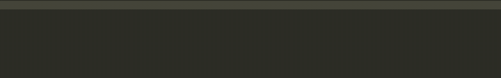

<blockquote style="color:#ff4">
Note: images should be placed inside the `img` folder within a modules directory. Audio and multimedia content should be placed in the media folder.  </blockquote>
<!-- .element: class="fragment" -->

---

Most snippets involve copying text before applying formatting. The same is true of adding movies, and sound files. If you want to learn more about the available snippets, please look through the snippets file. If you create your own custom snippets, feel free to share them through a github pull request.

---

## Changing the look and feel of your slides 

The layout and appearance of your slides are set using CSS, which is the language used to style web content. You can override the current theme by changing line 72 in ContentTemplate.html. reaveljs comes with lots of themes that you can choose from. In addition to changing the theme, you may also wish to modify some custom CSS attributes. You can do this in the same file, starting on line 10. 

ReavealJS is highly customisable. Or more details, please visit [RevealJS](https://revealjs.com/).

---

## Adding content to Moodle

Once you content is ready for publication on Moodle, you need to create a zip archive. Right-click and choose compress. This works for both Windows and MacOS.

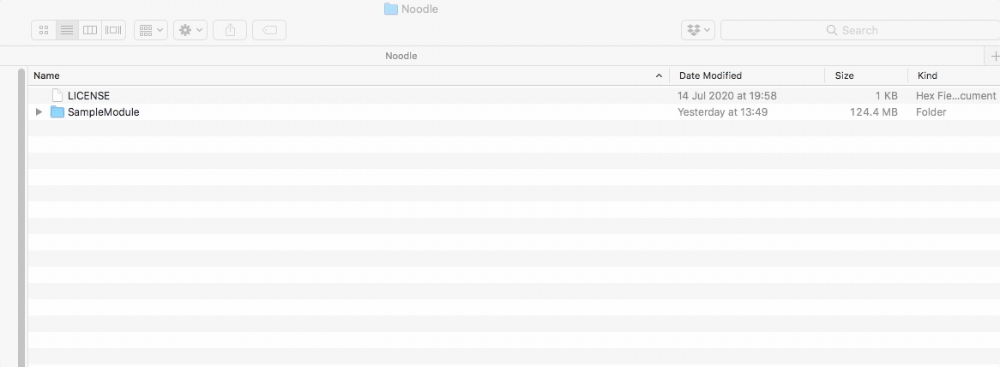

---

Now add the compressed archive to your Moodle page:

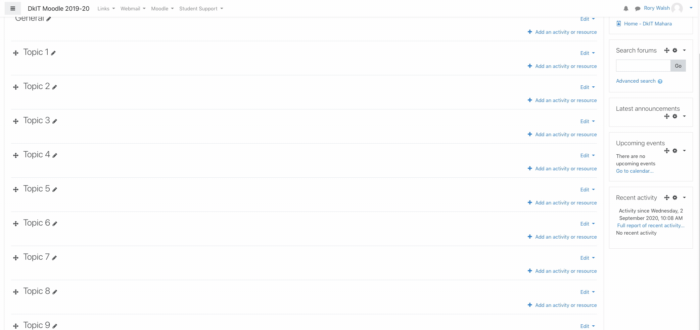

---

Now unzip the content to the server:

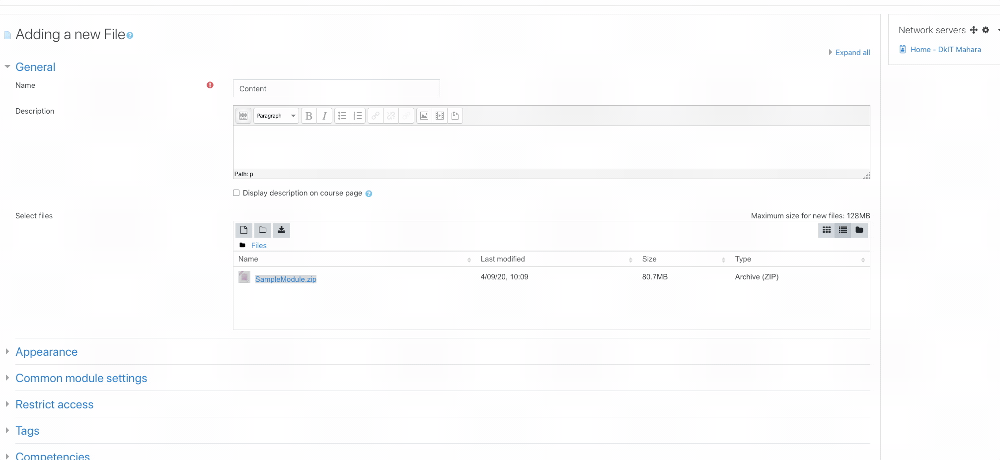

---

Once the archive has been unzipped, you need to navigate to the content folder. Select the content html file and set it as the main file. 

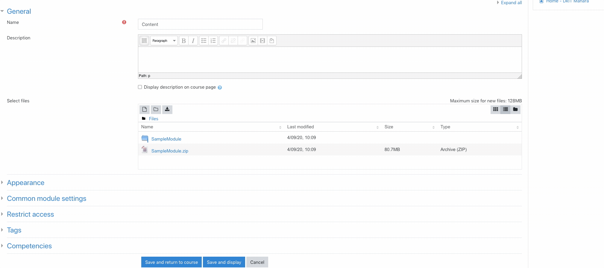

---

Now select the way it should appear. In this instance, we set it to open in a new window.

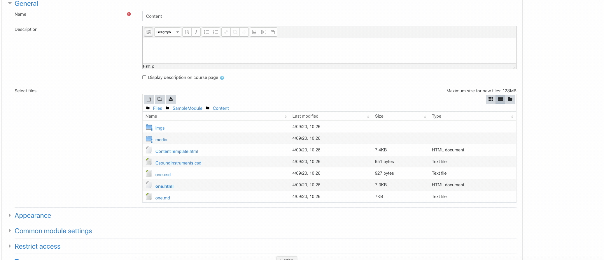

---

Back in the main Moodle page you can now click on the Content folder. This will open a new window with your content. 

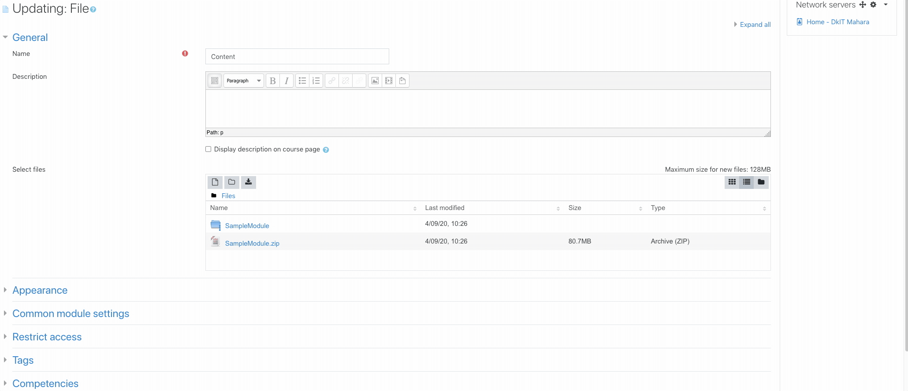

---

## Organising and managing slides

You don't need to zip, and unzip the entire content folder each time you want to add new slides. You only need add each new .html and .md files to your content folder. 

---

If you set each new slide as the main file, you will no longer be able to access the previous 'main slide'. To deal with this, simply copy the slide link and put it into a relevant topic, as shown below. 

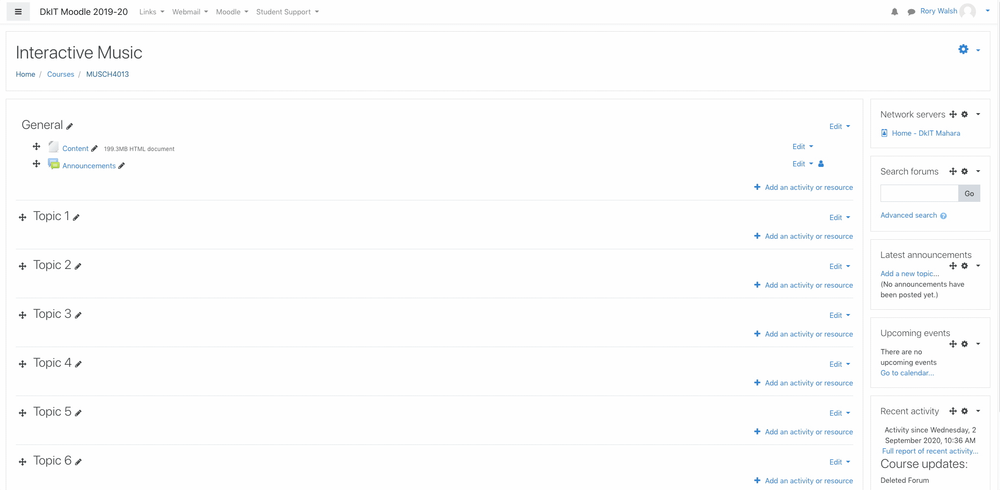

---

## Trouble shooting and support

You level of experience with code editors and computer languages are likely to determine how quickly you manage to get up and running with this framework. If you have any problems, just visit the [repository homepage](https://github.com/rorywalsh/Noodle) and file an issue. I will reply to you as quickly as I can.  

