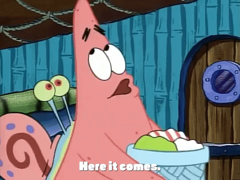
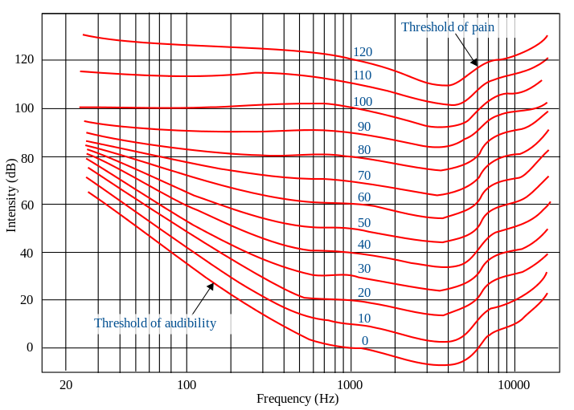

---

#### Taking the 'con' out of content

<!-- .element: class="fragment" -->
 
Rory Walsh

---

#### So what's the problem?

Notes:
* Proprietary software is a con!
* Like most proprietary systems, it tends to lead you toward their way of doing things
* Things get extremely frustrating when you want to do something different. 
* Then there are the limited list of supported formats for a range of multi-media  

---

#### Ok, and what's the solution?

Notes:
* The solution is to use free and open source framework
* Frameworks that compliment the open source content management system used in the school
* Frameworks that can open up new levels of interactivity in presentations

---

#### Frameworks such as?

**RevealJS** A HTML-based presentation framework 
<!-- .element: class="fragment" -->

**Katex** Math typesetting similar to Latex, but built specifically for the web. 
<!-- .element: class="fragment" -->

**p5js** A graphics library that provides easy to the HTML5 canvas
<!-- .element: class="fragment" -->

**Plotly** A JS based version of the well known Python library for interactive graphing  
<!-- .element: class="fragment" -->

**Csound** A web-based version of the popular audio programming language - for when WebAudio based libraries isn't up to the task...
<!-- .element: class="fragment" -->

---

#### Can we see some example?

Certainly. 

Notes:
* The following are a selection of the slides from various modules I've thought in the past year or two. 
* All content is hosting as a website directly within the student's Moodle homepage where the students can interact directly with the content 

---

The following is from Sound Design, a module on the Certificate in Sound Design for Interactive Applications.   

---

#### Loudness perception

The seminal work on loudness perception was done by Fletcher and Munson at Bell Laboratories, and reported in 1933. Since that time, many refinements have been made. 

The result of all of this was the development of so-called equal loudness contours.
<!-- .element: class="fragment" -->

---

In their experiments they ask a number of people to match a signal ascending upwards in frequency, with that of a steady tone at 1Kz, at a fixed amplitude. 

The results are shown in the following graph.

---

     <iframe width="100%" height="100%" scrolling="no" frameBorder="0" data-src="https://editor.p5js.org/rorywalsh/embed/h3IAAxmbSZ"></iframe>

---

The following is from Properties of Sound, a first year module on B.A. in Audio and Music Production.   

---

#### Tell us more, this is really interesting...

Feast your eyes upon the Discrete Fourier Transform!! 

$$X(k) = {{1}\over{N}} \sum_{t=1}^\{n-1} \cdot x(t) \cdot [ cos(2  \pi  k  ({{t}\over{SR}}) - j sin(2  \pi  k  ({{t}\over{SR}})]$$
<!-- .element: class="fragment" -->

<blockquote style="font-size:18px;color:#ddd;background-color:#111">
where $x(t)$ is the time domain signal, $N$ is its size in samples, $x(k)$ is the output spectra, $t$ is the time index and k is the frequency sample index. $N$ in this case is referred to as the transform size. </blockquote>
<!-- .element: class="fragment" -->

---

#### What the text books fail to mention...

...is that the average of the product of two sine waves will be 0 if they don't have the same frequency.  
<!-- .element: class="fragment" -->

---

#### Check it!

Each time a mouse click is detected, this sketch will generate two random waveforms with frequencies between 1 and 5. The waveform on the right is the product(multiplication) of the these two waveforms

     <iframe width="100%" height="100%" frameBorder="0" data-src="https://editor.p5js.org/rorywalsh/embed/qifpJ74dS"></iframe>

Do you notice anything about the resulting waveforms when the two waves on the left have the same frequency?

---

#### And what about complex waveforms?

     <iframe width="100%" height="100%" frameBorder="0" data-src="https://editor.p5js.org/rorywalsh/embed/gM9KiQrlr"></iframe>

This sketch shows a complex waveform with 10 harmonics. A slider can be used to change the frequency of the probe wave. 

---

The following is taken from a lecture in Creative Coding for interactive applications in the B.A. in Creative Media module.

---

#### Step Sequencer

<iframe height="400px" width="100%" src="https://editor.p5js.org/rorywalsh/sketches/9hSoVOQ8s"></iframe>

---

#### Oh shoot

What's a *shoot'em'up* without some shooting?!

     <iframe width="100%" height="100%" frameBorder="0" data-src="https://editor.p5js.org/rorywalsh/sketches/i-j3u4Gpr"></iframe>

---

The following is from a Sound Synthesis module in the old B.A in Music and Audio Production

---

#### Manipulating the audio stream 

Audio streams can be manipulated in two unique ways. The first and most common approach is the modify the sample data directly.  

   <iframe width="100%" height="100%" scrolling="no" frameBorder="0" data-src="https://editor.p5js.org/rorywalsh/embed/YP7THMBly"></iframe>

When audio is processed in this way, an algorithm is applied to a number of samples. This type of processing is known as time-domain processing.

---

#### Classic time domain processing

Almost all time-domain processes are based on the idea of mixing a delayed signal with its not delayed self. So let's start there, with the delay line. 

   <iframe width="100%" height="100%" scrolling="no" frameBorder="0" data-src="https://editor.p5js.org/rorywalsh/embed/H03cR32U5"></iframe>

---

A wet mix gain is typically applied to the delayed output to control how much of the delayed signal is heard.

   <iframe width="100%" height="100%" scrolling="no" frameBorder="0" data-src="https://editor.p5js.org/rorywalsh/embed/Qsk4ejnHr"></iframe>

---

#### Comb filters

A comb filter is a delay line with a feedback loop. 

   <iframe width="100%" height="100%" scrolling="no" frameBorder="0" data-src="https://editor.p5js.org/rorywalsh/embed/lYiwVBXTm"></iframe>

One must be careful with the gain of a comb filter as anything greater than 1 will cause the signal to get louder and louder on each iteration.
<!-- .element: class="fragment" -->

---

<section style="left: -9999px;" data-state="editor">

instr COMB_FILTER
    a1, a2 diskin2 "DutchLadyTalking.ogg", 1, 0, 1       ;load sound file
    aComb comb (a1+a2)/2, 5, .01                         ;add comb filter
    outs aComb, aComb                                    ;output
endin

schedule("COMB_FILTER", 0, 10)                           ;trigger instrument

</section>

---

####  Where to start?

Starting visiting the [https://github.com/rorywalsh/Noodle](https://github.com/rorywalsh/Noodle) repository where you will find a quick overview of how to get set up.   

     <iframe width="100%" height="100%" scrolling="no" frameBorder="0" data-src="https://rorywalsh.github.io/Noodle/SampleModule/Content/one.html#/
"></iframe>

---

     <iframe width="100%" height="100%" scrolling="no" frameBorder="0" data-src="https://editor.p5js.org/rorywalsh/embed/8L_sXLDBU"></iframe>

